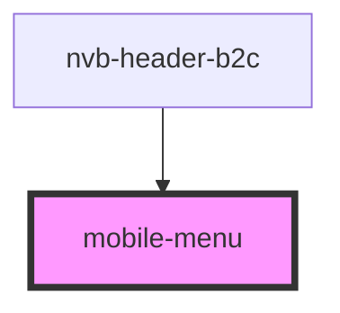

# mobile-menu

<!-- Auto Generated Below -->

## Properties

| Property    | Attribute    | Description | Type      | Default     |
| ----------- | ------------ | ----------- | --------- | ----------- |
| `isVisible` | `is-visible` |             | `boolean` | `undefined` |

## Events

| Event               | Description | Type                                  |
| ------------------- | ----------- | ------------------------------------- |
| `visibilityChanged` |             | `CustomEvent<VisibilityChangedEvent>` |

## Dependencies

### Used by

 - [nvb-header-b2c](../nvb-header-b2c)

### Graph

----------------------------------------------

*Built with [StencilJS](https://stenciljs.com/)*
