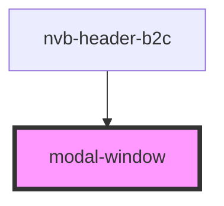

# modal-window

<!-- Auto Generated Below -->

## Properties

| Property     | Attribute     | Description | Type      | Default     |
| ------------ | ------------- | ----------- | --------- | ----------- |
| `isVisible`  | `is-visible`  |             | `boolean` | `undefined` |
| `modalText`  | `modal-text`  |             | `string`  | `undefined` |
| `modalTitle` | `modal-title` |             | `string`  | `undefined` |

## Events

| Event               | Description | Type                                  |
| ------------------- | ----------- | ------------------------------------- |
| `visibilityChanged` |             | `CustomEvent<VisibilityChangedEvent>` |

## Dependencies

### Used by

 - [nvb-header-b2c](../nvb-header-b2c)

### Graph

----------------------------------------------

*Built with [StencilJS](https://stenciljs.com/)*
